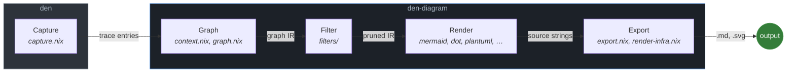

<p align="right">
  <a href="https://github.com/denful"></a>
  <a href="https://github.com/denful/den"></a>
  <a href="https://github.com/sini"></a>
  <a href="LICENSE"></a>
</p>

> part of the [denful](https://github.com/denful) ecosystem

# den-diagram

Diagram library for [den](https://github.com/denful/den) — graph IR construction, filtering, and multi-format rendering of aspect-resolution pipelines.

## Pipeline architecture

Den-diagram is organized as a five-stage pipeline. Each stage has a single responsibility and communicates through well-defined data shapes:



```
capture ─→ graph ─→ filter ─→ render ─→ export
(in den)   ─────────── (in den-diagram) ──────────
```

| Stage | Module(s) | Input | Output | Responsibility |
|-------|-----------|-------|--------|---------------|
| **Capture** | `den.lib.capture` (in den) | Resolved aspect tree | Structured trace entries | Run fx pipeline with tracing handlers, collect events |
| **Graph** | `context.nix`, `graph.nix` | Trace entries | Format-agnostic graph IR (nodes, edges, entity kinds) | Build graph IR from flat trace entries — no visual concerns |
| **Filter** | `filters/` | Graph IR | Pruned/reshaped graph IR | Prune, fold, slice, diff — pure transforms over the IR |
| **Render** | `mermaid.nix`, `dot.nix`, `plantuml.nix`, ... | Graph IR | Diagram source strings | Emit format-specific text — theme, colors, layout are render-time concerns |
| **Export** | `export.nix`, `render-infra.nix` | Source strings + `pkgs` | Nix derivations (`.md`, `.svg`) | Build derivations via mermaid-cli/graphviz/plantuml, assemble galleries |

The first stage (capture) lives in den because it drives the fx pipeline. Everything after that is den-diagram — pure functions over plain attrsets, with `export` being the only stage that touches `pkgs`.

## Usage

Add as a flake input:

```nix
inputs.den-diagram.url = "github:denful/den-diagram";
```

### Two-step pattern: capture in den, render in den-diagram

```nix
gram = inputs.den-diagram.lib;

# 1. Capture — runs in den, produces trace data
captured = den.lib.capture.captureWithPathsWith {
  classes = [ "nixos" "homeManager" ];
  root = den.lib.resolveEntity "host" { inherit host; };
  ctx = { inherit host; };
};

# 2. Graph — builds format-agnostic IR from trace entries
g = gram.context {
  entries = captured.entries;
  ctxTrace = captured.ctxTrace;
  name = host.name;
};

# 3. Render — emit diagram source in any supported format
rendered = gram.toMermaid g;
```

### Fleet graphs

```nix
fleetData = gram.fleet.of {
  hosts = den.hosts;
  flakeName = "my-fleet";
};
gram.toC4Context fleetData;
```

### Namespace graph (static aspect declarations)

```nix
g = gram.graph.ofNamespace { aspects = den.aspects; };
gram.toMermaid g;
```

### Render context (SVG pipeline with mermaid-cli)

```nix
rc = gram.renderContext {
  inherit pkgs;
  theme = gram.themeFromBase16 { inherit pkgs; scheme = "catppuccin-mocha"; };
};
svg = rc.mmdSourceToSvg "my-diagram" (gram.toMermaid g);
```

## Renderers

| Function | Format |
|----------|--------|
| `toMermaid` | Mermaid flowchart |
| `toDot` | Graphviz DOT |
| `toPlantUML` | PlantUML |
| `toC4Component`, `toC4Container`, `toC4Context` | PlantUML C4 |
| `toC4ComponentMermaid`, `toC4ContainerMermaid`, `toC4ContextMermaid` | Mermaid C4 |
| `toSequenceMermaid` | Scope sequence |
| `toPolicySequenceMermaid` | Policy sequence |
| `toSankeyMermaid`, `toFleetSankeyMermaid` | Sankey |
| `toTreemapMermaid`, `toFleetTreemapMermaid` | Treemap |
| `toMindmapMermaid` | Mindmap |
| `toStateMermaid` | State diagram |
| `toPipeFlowMermaid` | Pipe data flow |
| `toScopeTopologyMermaid` | Scope topology |
| `toFleetDagMermaid` | Fleet DAG |
| `toJSON` | Graph IR JSON |

Each renderer has a `*With` variant accepting `{ theme, mermaidConfig }` for customization.

## Graph filters

```nix
gram.graph.aspectsOnly g;         # aspect hierarchy only
gram.graph.providersOnly g;       # provider tree
gram.graph.contextOnly g;         # context scopes
gram.graph.simplified g;          # fold providers
gram.graph.classSlice "nixos" g;  # single class
gram.graph.diffClasses g;         # class comparison
gram.graph.filterUserAspects g;   # user-declared only
```

## Dependency model

Den-diagram depends only on `nixpkgs.lib`. It has no dependency on den's fx pipeline or module system. The dependency is one-directional: den → den-diagram.

```
den                           den-diagram
┌───────────────────┐         ┌──────────────────────────────────┐
│ captureWithPaths  │─ data ─>│ graph     -> format-agnostic IR  │
│ captureFleet      │         │ filters   -> pruned IR           │
│ captureAll        │         │ renderers -> source strings      │
│                   │         │ export    -> derivations         │
└───────────────────┘         └──────────────────────────────────┘
```
